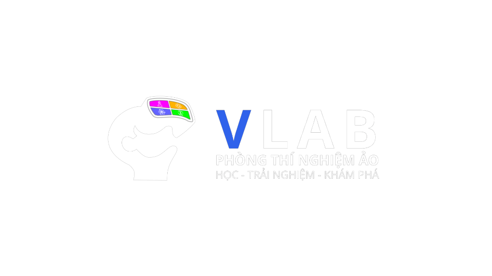

# VLAB — Virtual Laboratory

<p align="center">
  
</p>

<p align="center">
Virtual Laboratory là nền tảng phòng thí nghiệm thực tế ảo (VR) được phát triển nhằm phổ cập giáo dục STEM thông qua trải nghiệm thực hành trực quan, an toàn và chi phí thấp.
</p>

<p align="center">


</p>

---

# Giới thiệu

VLAB (Virtual Laboratory) là giải pháp phòng thí nghiệm thực tế ảo được xây dựng nhằm giải quyết tình trạng thiếu điều kiện thực hành STEM tại nhiều trường học, đặc biệt ở khu vực miền núi, vùng sâu, vùng xa và những nơi còn hạn chế về cơ sở vật chất.

Thay vì đầu tư các phòng thí nghiệm truyền thống với chi phí lớn, VLAB tận dụng điện thoại thông minh, kính VR giá rẻ và bộ điều khiển tương tác sử dụng ESP32 để mang đến trải nghiệm thực hành nhập vai ngay trong môi trường thực tế ảo.

Người học không chỉ quan sát mà còn trực tiếp thao tác với các dụng cụ, mô hình và thí nghiệm giống như trong phòng thí nghiệm thật, từ đó nâng cao khả năng tiếp cận giáo dục STEM một cách trực quan, an toàn và hiệu quả.

---

# Vấn đề

Trong quá trình khảo sát thực tế tại nhiều trường THPT trên địa bàn tỉnh Cao Bằng, nhóm nhận thấy:

- Thiếu phòng thí nghiệm STEM.
- Thiếu thiết bị thực hành.
- Chi phí đầu tư cao.
- Một số thí nghiệm tiềm ẩn rủi ro mất an toàn.
- Nhiều học sinh chỉ được quan sát thay vì trực tiếp thực hành.
- Học sinh có nhu cầu trải nghiệm công nghệ VR nhưng rất ít cơ hội tiếp cận.

Trong khi đó, phần lớn học sinh hiện nay đều đã sở hữu điện thoại thông minh có khả năng đáp ứng nhu cầu học tập bằng công nghệ thực tế ảo.

---

# Giải pháp

VLAB xây dựng một hệ thống phòng thí nghiệm thực tế ảo dựa trên ba thành phần chính:

- Ứng dụng VR phát triển bằng Unity.
- Bộ điều khiển tương tác ESP32.
- Điện thoại thông minh kết hợp kính VR.

Dữ liệu chuyển động từ bộ điều khiển được truyền tới điện thoại thông qua Bluetooth Low Energy (BLE), sau đó đồng bộ với môi trường 3D trong Unity để tạo nên trải nghiệm nhập vai theo thời gian thực.

---

# Mục tiêu

VLAB hướng tới việc xây dựng một nền tảng phòng thí nghiệm ảo có khả năng:

- Phổ cập giáo dục STEM.
- Giảm chi phí triển khai.
- Tăng cơ hội thực hành.
- Đảm bảo an toàn cho học sinh.
- Dễ dàng mở rộng thêm nhiều bài học trong tương lai.

---

# Giá trị cốt lõi

- Tiếp cận
- Trực quan
- An toàn
- Chi phí thấp
- Khả năng mở rộng

---

# Đối tượng sử dụng

- Học sinh THPT
- Giáo viên
- Nhà trường
- Các chương trình giáo dục STEM

---

# Công nghệ

## Software

- Unity
- C
- Unity XR
- Android

## Embedded

- ESP32
- MPU9250
- Bluetooth Low Energy (BLE)
- ESP-NOW

---

# Cài đặt & sử dụng

VLAB hiện là **project Unity đang trong quá trình phát triển**. Repository cung cấp source code để mở project, xem prototype và tiếp tục phát triển trên môi trường Unity.

## Yêu cầu

| Thành phần | Yêu cầu |
|---|---|
| Unity | **Unity 6** |
| Hệ điều hành | Windows — khuyến nghị |
| Git | Dùng để clone repository |
| Thiết bị kiểm thử | Smartphone Android — khi kiểm thử phiên bản Android |
| VR | Smartphone + kính VR — khi kiểm thử trải nghiệm VR |
| Hardware | ESP32 + MPU9250 — khi kiểm thử controller |

---

## 1. Tải source code

### Cách 1 — Clone bằng Git

Mở Terminal hoặc Git Bash:

```bash
git clone <REPOSITORY_URL>
```

Sau khi tải xong, mở thư mục project:

```bash
cd <VLAB_PROJECT_FOLDER>
```

### Cách 2 — Download ZIP

Trên GitHub:

```text
Code
→ Download ZIP
```

Giải nén file ZIP vào thư mục bạn muốn lưu project.

> Không tạo Unity Project mới. Source trong repository đã là một Unity Project.

---

## 2. Mở project

Mở **Unity Hub**:

```text
Add
→ Add project from disk
→ Chọn thư mục VLAB
→ Open
```

Chọn project bằng **Unity 6**.

Thư mục được chọn phải là thư mục gốc của project và chứa cấu trúc Unity:

```text
VLAB/
├── Assets/
├── Packages/
├── ProjectSettings/
└── ...
```

Khi mở lần đầu, Unity sẽ tự xử lý quá trình import project. Thời gian xử lý phụ thuộc vào máy và dữ liệu của project.

---

## 3. Chạy prototype

Sau khi Unity mở project thành công:

1. Mở Scene có sẵn trong project.
2. Nhấn **Play ▶** trên Unity Editor.
3. Kiểm tra prototype trực tiếp trong Editor.

Các chức năng phụ thuộc vào thiết bị thực tế không nhất thiết có thể kiểm tra đầy đủ trong Unity Editor.

---

## 4. Kiểm thử trên thiết bị

VLAB được thiết kế theo kiến trúc kết hợp:

```text
ESP32 Controller
       ↓
Bluetooth Low Energy
       ↓
Smartphone
       ↓
Unity XR
       ↓
VR Environment
```

Theo kiến trúc dự án, controller sử dụng ESP32 và cảm biến IMU MPU9250; dữ liệu được truyền tới smartphone thông qua Bluetooth Low Energy để Unity XR xử lý và đồng bộ với môi trường 3D.

Để kiểm thử trải nghiệm đầy đủ, cần có các thành phần phần cứng tương ứng của prototype.

---

## Lưu ý

VLAB **chưa phải bản ứng dụng phát hành hoàn chỉnh**. Project hiện được sử dụng cho quá trình phát triển và thử nghiệm prototype.

Một số thành phần của hệ thống, bao gồm môi trường VR, các phòng thí nghiệm và tích hợp hardware, vẫn đang tiếp tục được phát triển.

---

# Định hướng

VLAB không chỉ là một ứng dụng mô phỏng mà hướng tới trở thành nền tảng Virtual Laboratory có khả năng mở rộng nhiều lĩnh vực STEM như:

- Physics Lab
- Chemistry Lab
- Biology Lab
- Engineering Lab

---

# Tầm nhìn

Mọi học sinh đều có cơ hội tiếp cận phòng thí nghiệm STEM chất lượng cao, bất kể điều kiện cơ sở vật chất của nhà trường.

Thông qua việc kết hợp công nghệ thực tế ảo, thiết bị nhúng và điện thoại thông minh, VLAB hướng tới xây dựng một hệ sinh thái học tập trực quan, hiện đại và có khả năng triển khai rộng rãi trong giáo dục phổ thông.

---

> **Samsung Solve for Tomorrow 2026**  
> **VLAB — Creating Technology for Every Student**
